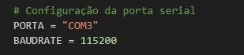

# Python-Serial-Port
Python script for reading data from a serial port and saving it as a CSV file.

---
### How to use
Before running the script, select the serial port by setting the PORTA variable.

After running, the script will create a folder to save the data in CSV format.
